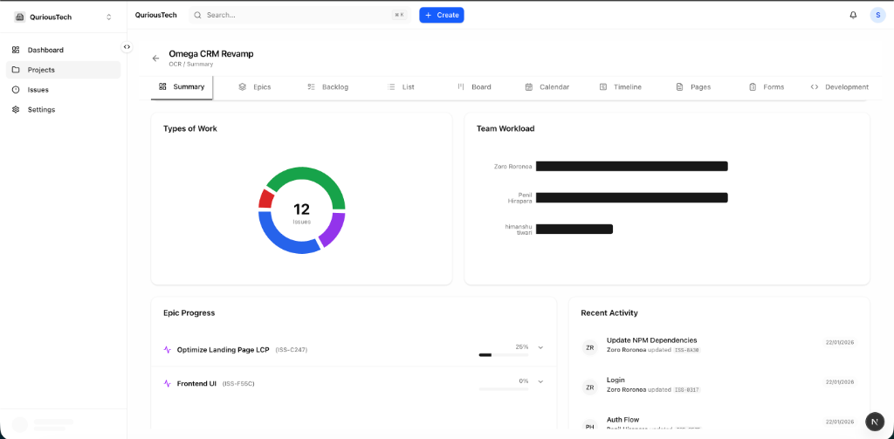
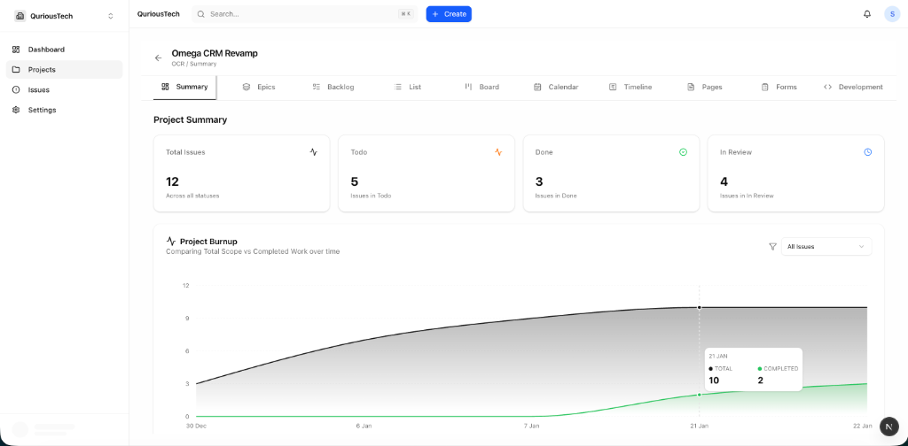
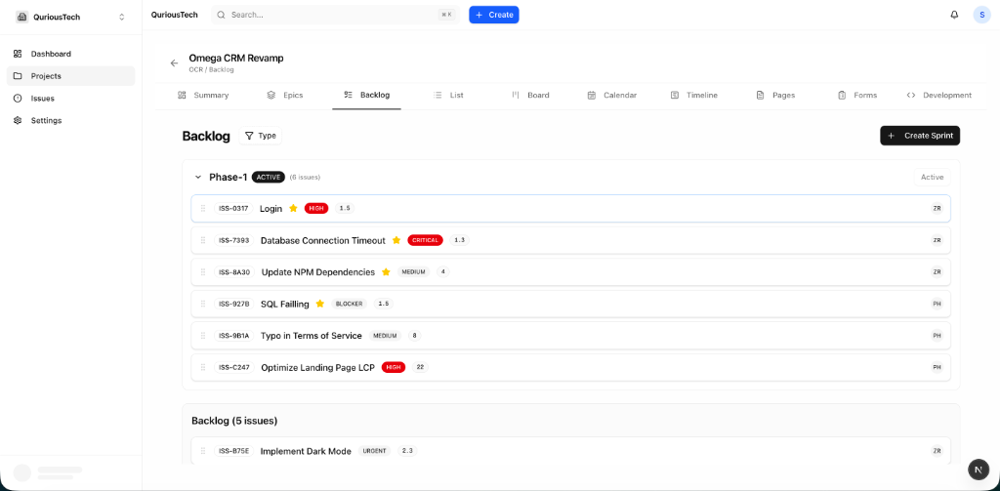
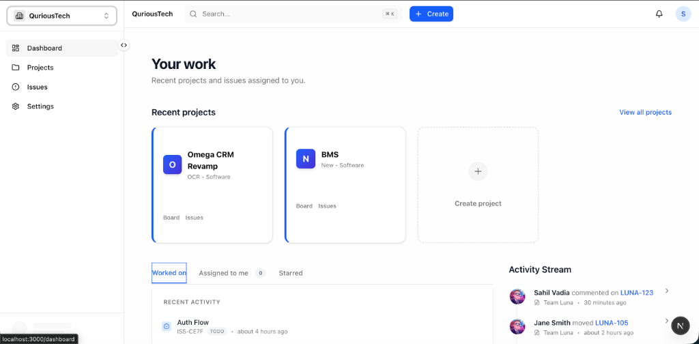
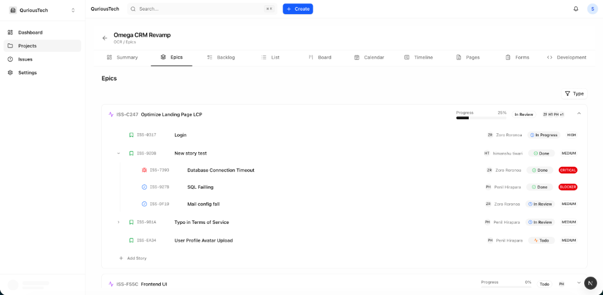
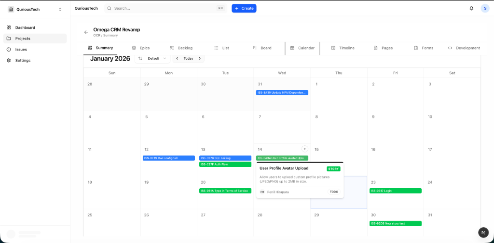
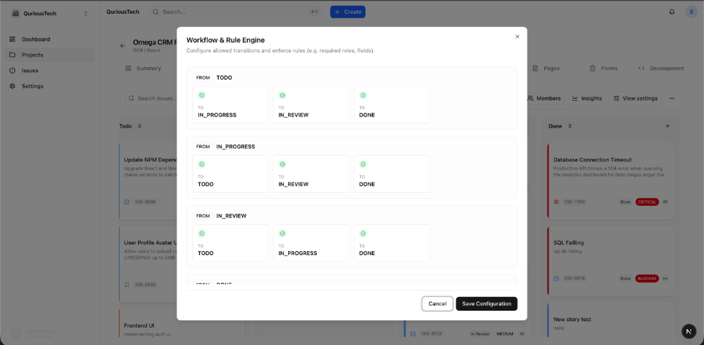
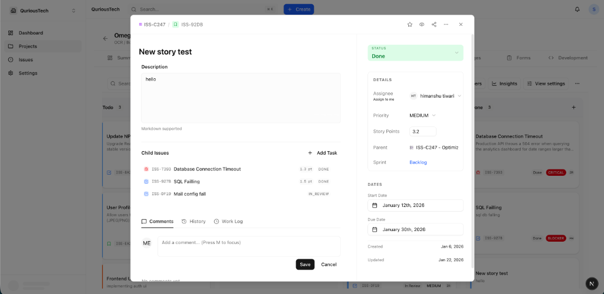
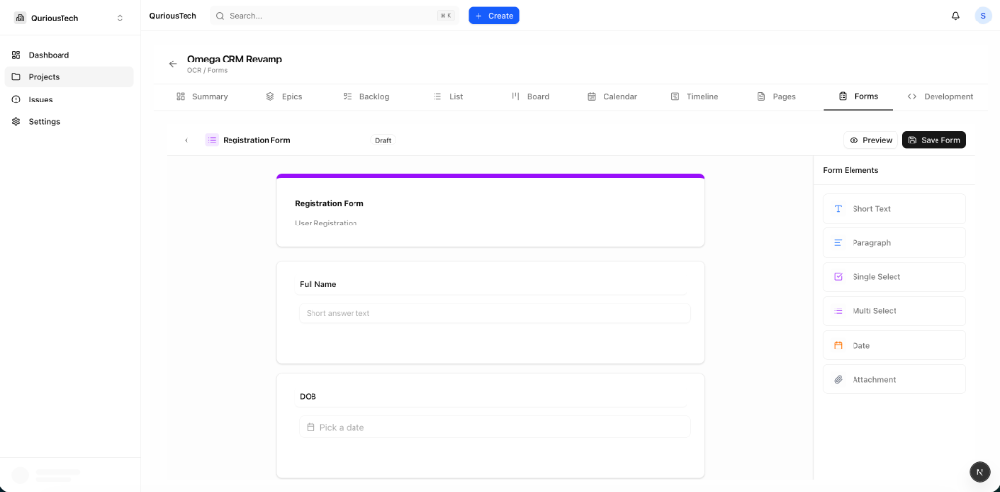

# TaskForge Frontend

**TaskForge Frontend** is a modern, responsive single-page application built with **Next.js 14**, providing a premium user experience for project management, issue tracking, and agile collaboration.

It interacts with the TaskForge Backend via REST APIs and authenticates users using **Keycloak (OAuth2/OIDC)**.

---

## Key Features

- **Modern Dashboard**: High-performance, responsive UI providing a centralized view of projects.
- **Issue Tracking**: Full Kanban board, list views, and calendar views.
- **Project Management**: Create and configure projects with ease.
- **Agile Sprints**: Plan and manage sprints with drag-and-drop capabilities.
- **Team Collaboration**: Integrated member management and role-based access.
- **Dark Mode**: Fully supported system-aware dark theme.
- **Drag & Drop**: Smooth interactions powered by `dnd-kit`.

---

## Screenshots

### Interactive Dashboard
The central hub for your workflow. View recent projects, track activity streams, and access quick actions.


### Project Overview & Analytics
Get high-level insights into project health with "Types of Work" distribution and Team Workload charts.


### Metrics & Burndown Charts
Track project progress with automated burnup charts and real-time issue status summaries.


### Agile Backlog Management
Plan and organize work efficiently. Create sprints, prioritize issues using drag-and-drop, and manage your backlog.


### Kanban Board
Visualize work in progress with a fully interactive Kanban board. Customizable columns, drag-and-drop support, and filter by Issue Type.


### Epic & Roadmap Planning
Visualize high-level goals and track progress across multiple stories with the Epics view.


### Interactive Calendar
Manage deadlines and schedule sprints effectively with the drag-and-drop calendar view.


### Workflow & Rule Engine
Customize your project's workflow with a powerful rule engine to automate status transitions.


### Issue Details & Editing
A comprehensive modal for editing issues, adding subtasks, comments, and tracking history.


### Form Builder
Design custom intake forms to capture structured data directly into your project.


---

## Tech Stack

| Technology | Purpose |
| :--- | :--- |
| **Next.js 14** | React Framework (App Router) |
| **TypeScript** | Type Safety & Developer Experience |
| **Tailwind CSS** | Utility-first Styling |
| **shadcn/ui** | Reusable UI Components |
| **TanStack Query** | Server State Management & Caching |
| **Zustand** | Global Client State Management |
| **NextAuth.js** | Authentication (OIDC with Keycloak) |
| **dnd-kit** | Drag-and-Drop Primitives |
| **React Hook Form** | Form Management |
| **Zod** | Schema Validation |

---

## Architecture Overview

- **Authentication**: Uses `next-auth` to handle OIDC flow with Keycloak.
- **State Management**:
  - **Server State**: `TanStack Query` handles data fetching, caching, and mutations.
  - **Client State**: `Zustand` manages UI state (sidebar toggle, modals, etc.).
- **Styling**: Built with `Tailwind CSS` and `Radix UI` primitives via `shadcn/ui`.
- **Feature-Based Folder Structure**: Code is organized by domain features (`features/issues`, `features/projects`) rather than technical layers.

---

## Getting Started

### Prerequisites

- **Node.js 18+**
- **npm** or **yarn**
- **Running Backend Services**: Ensure the TaskForge Backend, Keycloak, and Database are running.
  - Backend Repository: [https://github.com/sahilvadia7/taskforge-backend](https://github.com/sahilvadia7/taskforge-backend)

### 1. Installation

```bash
npm install
# or
yarn install
```

### 2. Environment Configuration

Create a `.env.local` file in the root directory:

```properties
# App URL
NEXTAUTH_URL=http://localhost:3000

# Backend API URL (Port 8081)
NEXT_PUBLIC_API_BASE_URL=http://localhost:8081/api/v1

# NextAuth Configuration
NEXTAUTH_SECRET=your_super_secret_random_string

# Keycloak Provider
KEYCLOAK_CLIENT_ID=taskforge-web
KEYCLOAK_CLIENT_SECRET=Utsr2rPmccLGoRjRHBJ45Wj9jEBMVByU
KEYCLOAK_ISSUER=http://localhost:10091/realms/taskforge
```

> **Note**: The `KEYCLOAK_CLIENT_SECRET` must match the one configured in Keycloak for the `taskforge-web` client.

### 3. Run Development Server

```bash
npm run dev
```

Open [http://localhost:3000](http://localhost:3000) in your browser.

---

## Project Structure

```text
src/
├── app/                 # Next.js App Router (pages & layouts)
├── components/          # Shared UI components (Button, Input, etc.)
├── features/            # Feature-specific modules
│   ├── issues/          # Issue board, list, creation logic
│   ├── projects/        # Project dashboard, settings
│   ├── boards/          # Kanban board components
│   └── auth/           # Authentication logic
├── lib/                 # Utilities, API clients, helpers
├── store/               # Zustland global stores
└── types/               # TypeScript type definitions
```

---

## Troubleshooting

- **Authentication Errors**:
  - Ensure Keycloak is running at `http://localhost:10091`.
  - Check `NEXTAUTH_URL` matches your browser URL.
  - Verify `KEYCLOAK_CLIENT_ID` and `SECRET` in `.env.local`.

- **API Connection Failed**:
  - Ensure Backend is running on port `8081`.
  - Check browser console for CORS errors.
  - Verify `NEXT_PUBLIC_API_BASE_URL` is correct.

- **Hydration Errors**:
  - Usually caused by mismatched HTML between server and client. Check console for specific element details.

---

## License

This project is proprietary and intended for internal or educational use.

---

Built with ❤️ using Next.js & React
